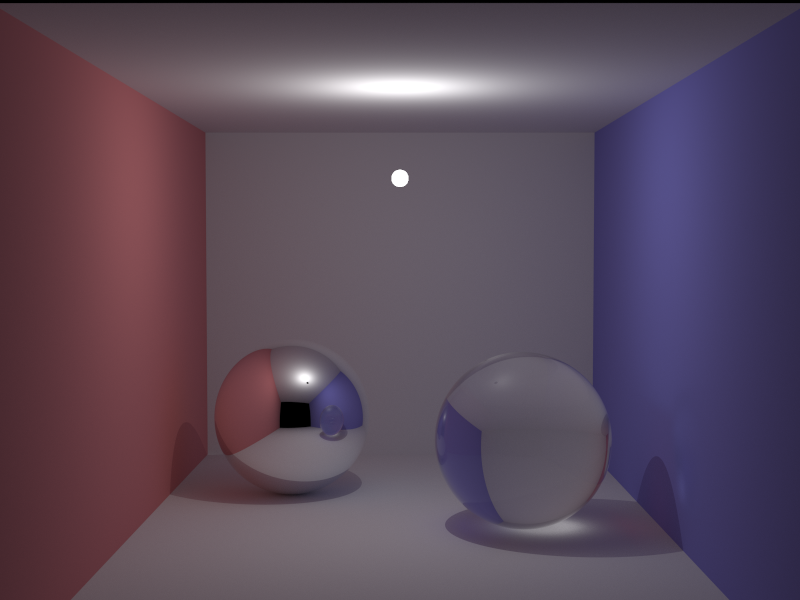

# RayTracer Documentation

## Preview



The render was converted to `image.png` so it displays correctly in the
documentation preview.

## Overview

RayTracer is a ray tracing engine written in C++20.
The program reads an external scene file, computes the image, and then
produces an output file in PPM format.

## Features

### Implemented foundation

- `raytracer` as the main binary name
- C++ architecture with separate folders for `src`, `include`, `libs`, and
	`plugins`
- Dedicated error handling through an exception hierarchy
- Primitive support through interfaces in `include/object`
- Plugin system planned for dynamic primitives

### Project goals from the specification

- Primitives: sphere, plane
- Transformations: translation
- Lights: ambient light, directional light
- Materials: flat color
- Scene configuration: camera, lights, primitives
- Interface: PPM output without a GUI

## Repository Layout

- `src/` : entry point, application core, and exception implementation
- `include/` : public project headers
- `libs/` : libraries and dynamic plugins
- `plugins/` : shared library output directory
- `tests/` : unit tests
- `docs/` : additional documentation

## Build

The project is configured with CMake.

```bash
mkdir -p build
cd build
cmake .. -G "Unix Makefiles" -DCMAKE_BUILD_TYPE=Release
cmake --build .
```

The main binary is generated at the root of the repository as `raytracer`.

## Usage

```bash
./raytracer --help
USAGE: ./raytracer <SCENE_FILE>
SCENE_FILE: scene configuration
```

The program expects a scene configuration file as input.

## Scene Configuration Example

The example below follows the scene structure requested in the assignment.
It can be used as a base for your demo files.

```json
# Camera configuration
camera:
{
    resolution = { width = 1920; height = 1080; };
    position = { x = 0; y = -100; z = 20; };
    rotation = { x = 0; y = 0; z = 0; };
    fieldOfView = 72.0;
};

# Primitives in the scene
primitives:
{
    spheres = (
            { x = 60; y = 5; z = 40; r = 25; color = { r = 255; g = 64; b = 64; }; },
            { x = -40; y = 20; z = -10; r = 35; color = { r = 64; g = 255; b = 64; }; }
    );

    planes = (
            { axis = "Z"; position = -20; color = { r = 64; g = 64; b = 255; }; }
    );
};

# Light configuration
lights:
{
    ambient = 0.4;
    diffuse = 0.6;

    point = (
            { x = 400; y = 100; z = 500; }
    );

    directional = ();
};
```

You can view the example scene configuration here: [ConfigPreview](exemple.cfg)

## Architecture

The project follows a simple separation between interface, engine, and
plugins.

- Primitives and lights are abstracted through interfaces in `include/object`
- Exceptions are separated by domain in `include/exception`
- Plugins are compiled from `libs/*` and placed in `plugins/`

### Existing plugin example

The `sphere` plugin is already set up in `libs/primitive/sphere/` with a
`SpherePlugin.cpp` entry point and a shared library output configured by
CMake.

## Exceptions

The project uses an exception hierarchy to report errors with more precise
context.

- `Exception` : base class
- `ParsingException` : configuration error
- `PluginException` : plugin loading or execution error
- `CoreException` : application core error

The error message is enriched with source location information to make
debugging easier.

## Notes

- The source file `image.ppm` is available at the repository root.
- The preview uses `image.png`, generated from the PPM render.

